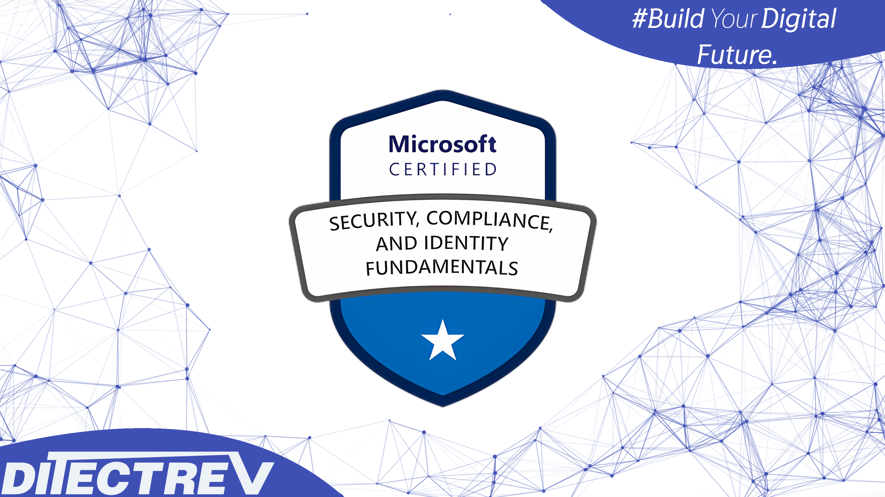

# ⬆️ Microsoft SC-900 (Microsoft Security, Compliance, and Identity Fundamentals) Practice Tests Exams Questions & Answers

## Table of Contents

| No. | Questions |
| --- | --------- |
| 1   | [Conditional access policies always enforce the user of multi-factor authentication (MFA).](#conditional-access-policies-always-enforce-the-user-of-multi-factor-authentication-mfa)
| 2   | [Conditional access policies can be used to block access to an application based on the location of the user.](#conditional-access-policies-can-be-used-to-block-access-to-an-application-based-on-the-location-of-the-user)
| 3   | [Conditional access policies only affect users who have Azure Active Directory (Azure AD)-joined devices.](#conditional-access-policies-only-affect-users-who-have-azure-active-directory-azure-ad-joined-devices)
| 4   | [[...] is used to identify, hold, and export electronic information that might be used in an investigation.](#-is-used-to-identify-hold-and-export-electronic-information-that-might-be-used-in-an-investigation)
| 5   | [Microsoft Defender for Endpoint can protect Android devices.](#microsoft-defender-for-endpoint-can-protect-android-devices)
| 6   | [Microsoft Defender for Endpoint can protect Azure virtual machines that run Windows 10.](#microsoft-defender-for-endpoint-can-protect-azure-virtual-machines-that-run-windows-10)
| 7   | [Microsoft Defender for Endpoint can protect Microsoft SharePoint Online sites and content from viruses.](#microsoft-defender-for-endpoint-can-protect-microsoft-sharepoint-online-sites-and-content-from-viruses)
| 8   | [What feature in Microsoft Defender for Endpoint provides the first line of defense against cyberthreats by reducing the attack surface?](#what-feature-in-microsoft-defender-for-endpoint-provides-the-first-line-of-defense-against-cyberthreats-by-reducing-the-attack-surface)
| 9   | [Which score measures an organization’s progress in completing actions that help reduce risks associated to data protection and regulatory standards?](#which-score-measures-an-organizations-progress-in-completing-actions-that-help-reduce-risks-associated-to-data-protection-and-regulatory-standards)
| 10  | [You can add a resource lock to an Azure subscription.](#you-can-add-a-resource-lock-to-an-azure-subscription)
| 11  | [You can add only one resource lock to an Azure resource.](#you-can-add-only-one-resource-lock-to-an-azure-resource)
| 12  | [You can delete a resource group containing resources that have resources locks.](#you-can-delete-a-resource-group-containing-resources-that-have-resources-locks)
| 13  | [Azure Defender can detect vulnerabilities and threats for Azure Storage.](#azure-defender-can-detect-vulnerabilities-and-threats-for-azure-storage)
| 14  | [Cloud Security Posture Management (CSPM) is available for all Azure subscriptions.](#cloud-security-posture-management-cspm-is-available-for-all-azure-subscriptions)
| 15  | [Azure Security Center can evaluate the security of workloads deployed to Azure or on-premises.](#azure-security-center-can-evaluate-the-security-of-workloads-deployed-to-azure-or-on-premises)
| 16  | [In the shared responsibility model for an Azure deployment, what is Microsoft solely responsible for managing?](#in-the-shared-responsibility-model-for-an-azure-deployment-what-is-microsoft-solely-responsible-for-managing)
| 17  | [Which Microsoft 365 feature can you use to restrict communication and the sharing of information between members of two departments at your organization?](#which-microsoft-365-feature-can-you-use-to-restrict-communication-and-the-sharing-of-information-between-members-of-two-departments-at-your-organization)
| 18  | [You can use [...] in the Microsoft 365 security center to identify devices that are affected by an alert.](#you-can-use--in-the-microsoft-365-security-center-to-identify-devices-that-are-affected-by-an-alert)
| 19  | [When users sign in to the Azure portal, they are first [...].](#when-users-sign-in-to-the-azure-portal-they-are-first-)
| 20  | [You plan to implement a security strategy and place multiple layers of defense throughout a network infrastructure. Which security methodology does this represent?](#you-plan-to-implement-a-security-strategy-and-place-multiple-layers-of-defense-throughout-a-network-infrastructure-which-security-methodology-does-this-represent)
| 21  | [Compliance Manager assesses compliance data [...] for an organization.](#compliance-manager-assesses-compliance-data--for-an-organization)
| 22  | [What should you use in the Microsoft 365 security center to view security trends and track the protection status of identities?](#what-should-you-use-in-the-microsoft-365-security-center-to-view-security-trends-and-track-the-protection-status-of-identities)
| 23  | [Digitally signing a document requires a private key.](#digitally-signing-a-document-requires-a-private-key)
| 24  | [Verifying the authenticity of a digitally signed document requires the public key of the signer.](#verifying-the-authenticity-of-a-digitally-signed-document-requires-the-public-key-of-the-signer)
| 25  | [Verifying the authenticity of a digitally signed document requires the private key of the signer.](#verifying-the-authenticity-of-a-digitally-signed-document-requires-the-private-key-of-the-signer)
| 26  | [In the Microsoft Cloud Adoption Framework for Azure, which two phases are addressed before the Ready phase?](#in-the-microsoft-cloud-adoption-framework-for-azure-which-two-phases-are-addressed-before-the-ready-phase)
| 27  | [What can you use to provide a user with a two-hour window to complete an administrative task in Azure?](#what-can-you-use-to-provide-a-user-with-a-two-hour-window-to-complete-an-administrative-task-in-azure)
| 28  | [Applying system updates increases an organization's secure score in Azure Security Center.](#applying-system-updates-increases-an-organizations-secure-score-in-azure-security-center)
| 29  | [The secure score in Azure Security Center can evaluate resources across multiple Azure subscriptions.](#the-secure-score-in-azure-security-center-can-evaluate-resources-across-multiple-azure-subscriptions)
| 30  | [Enabling multi-factor authentication (MFA) increases an organization's secure score in Azure Security Center.](#enabling-multi-factor-authentication-mfa-increases-an-organizations-secure-score-in-azure-security-center)
| 31  | [[...] enables collaboration with business partners from external organizations such as suppliers, partners, and vendors. External users appear as guest in the directory.](#-enables-collaboration-with-business-partners-from-external-organizations-such-as-suppliers-partners-and-vendors-external-users-appear-as-guest-in-the-directory)
| 32  | [Which Microsoft portal provides information about how Microsoft manages privacy, compliance, and security?](#which-microsoft-portal-provides-information-about-how-microsoft-manages-privacy-compliance-and-security)
| 33  | [What can you use to scan email attachments and forward the attachments to recipients only if the attachments are free from malware?](#what-can-you-use-to-scan-email-attachments-and-forward-the-attachments-to-recipients-only-if-the-attachments-are-free-from-malware)
| 34  | [What is the purpose of Azure Active Directory (Azure AD) Password Protection?](#what-is-the-purpose-of-azure-active-directory-azure-ad-password-protection)
| 35  | [Network security groups (NSGs) can deny inbound traffic from the internet.](#network-security-groups-nsgs-can-deny-inbound-traffic-from-the-internet)
| 36  | [Network security groups (NSGs) can deny outbound traffic to the internet.](#network-security-groups-nsgs-can-deny-outbound-traffic-to-the-internet)
| 37  | [Network security groups (NSGs) can filter traffic based on IP address, protocol, and port.](#network-security-groups-nsgs-can-filter-traffic-based-on-ip-address-protocol-and-port)
| 38  | [What is an example of encryption at rest?](#what-is-an-example-of-encryption-at-rest)
| 39  | [Azure DDoS Protection Standard can be used to protect [...].](#azure-ddos-protection-standard-can-be-used-to-protect-)
| 40  | [Which three authentication methods can be used by Azure Multi-Factor Authentication (MFA)?](#which-three-authentication-methods-can-be-used-by-azure-multi-factor-authentication-mfa)
| 41  | [Which Microsoft 365 compliance center feature can you use to identify all the documents on a Microsoft SharePoint Online site that contain a specific key word?](#which-microsoft-365-compliance-center-feature-can-you-use-to-identify-all-the-documents-on-a-microsoft-sharepoint-online-site-that-contain-a-specific-key-word)
| 42  | [You can use the insider risk management solution to detect phising scams.](#you-can-use-the-insider-risk-management-solution-to-detect-phising-scams)
| 43  | [You can access the insider risk management solution from the Microsoft 365 compliance center.](#you-can-access-the-insider-risk-management-solution-from-the-microsoft-365-compliance-center)
| 44  | [You can use the insider risk management solution to detect data leaks by unhappy employees.](#you-can-use-the-insider-risk-management-solution-to-detect-data-leaks-by-unhappy-employees)
| 45  | [What are two capabilities of Microsoft Defender for Endpoint?](#what-are-two-capabilities-of-microsoft-defender-for-endpoint)
| 46  | [Microsoft Intune can be used to manage Android devices.](#microsoft-intune-can-be-used-to-manage-android-devices)
| 47  | [Microsoft Intune can be used to provision Azure subscriptions.](#microsoft-intune-can-be-used-to-provision-azure-subscriptions)
| 48  | [Microsoft Intune can be used to manage organization-owned devices and personal devices.](#microsoft-intune-can-be-used-to-manage-organization-owned-devices-and-personal-devices)
| 49  | [Compliance Manager tracks only customer-managed controls.](#compliance-manager-tracks-only-customer-managed-controls)
| 50  | [Compliance Manager provides predefined templates for creating assessments.](#compliance-manager-provides-predefined-templates-for-creating-assessments)
| 51  | [Compliance Manager can help you asses whether data adheres to specific data protection standards.](#compliance-manager-can-help-you-asses-whether-data-adheres-to-specific-data-protection-standards)
| 52  | [Which two tasks can you implement by using data loss prevention (DLP) policies in Microsoft 365?](#which-two-tasks-can-you-implement-by-using-data-loss-prevention-dlp-policies-in-microsoft-365)
| 53  | [[...] requires additional verification, such as a verification code sent to a mobile phone.](#-requires-additional-verification-such-as-a-verification-code-sent-to-a-mobile-phone)
| 54  | [With Advanced Audit in Microsoft 365, you can identify when email items were accessed.](#with-advanced-audit-in-microsoft-365-you-can-identify-when-email-items-were-accessed)
| 55  | [Advenced Audit in Microsoft 365 supports the same retention period of audit logs as core auditing.](#advenced-audit-in-microsoft-365-supports-the-same-retention-period-of-audit-logs-as-core-auditing)
| 56  | [Advanced Audit in Microsoft 365 allocates customer-dedicated bandwidth for accessing audit data.](#advanced-audit-in-microsoft-365-allocates-customer-dedicated-bandwidth-for-accessing-audit-data)
| 57  | [[...] provides a central location for managing information protection, information governance, and data loss prevention (DLP) policies.](#-provides-a-central-location-for-managing-information-protection-information-governance-and-data-loss-prevention-dlp-policies)
| 58  | [Which Microsoft 365 compliance feature can you use to encrypt content automatically based on specific conditions?](#which-microsoft-365-compliance-feature-can-you-use-to-encrypt-content-automatically-based-on-specific-conditions)
| 59  | [In Azure Sentinel, you can automate common tasks by using [...].](#in-azure-sentinel-you-can-automate-common-tasks-by-using-)
| 60  | [All Azure active Directory (Azure AD) license editions include the same features.](#all-azure-active-directory-azure-ad-license-editions-include-the-same-features)
| 61  | [You can manage an Azure Active Directory (Azure AD) tenant by using the Azure portal.](#you-can-manage-an-azure-active-directory-azure-ad-tenant-by-using-the-azure-portal)
| 62  | [You must deploy Azure virtual machines to host an Azure Active Directory (Azure AD) tenant.](#you-must-deploy-azure-virtual-machines-to-host-an-azure-active-directory-azure-ad-tenant)
| 63  | [Azure Active Directory (Azure AD) is [...] used for authentication and authorization.](#azure-active-directory-azure-ad-is--used-for-authentication-and-authorization)
| 64  | [[...] can be used to provide Microsoft Support Engineers with access to an organization's data stored in Microsoft Exchange Online, SharePoint Online, and OneDrive for Business.](#-can-be-used-to-provide-microsoft-support-engineers-with-access-to-an-organizations-data-stored-in-microsoft-exchange-online-sharepoint-online-and-onedrive-for-business)
| 65  | [What do you use to provide real-time integration between Azure Sentinel and another security source?](#what-do-you-use-to-provide-real-time-integration-between-azure-sentinel-and-another-security-source)
| 66  | [You can create custom roles in Azure Active Directory (Azure AD).](#you-can-create-custom-roles-in-azure-active-directory-azure-ad)
| 67  | [Global administrator is a role in Azure Active Directory (Azure AD).](#global-administrator-is-a-role-in-azure-active-directory-azure-ad)
| 68  | [An Azure Active Directory (Azure AD) user can be assigned only one role.](#an-azure-active-directory-azure-ad-user-can-be-assigned-only-one-role)
| 69  | [Azure Active Directory (Azure AD) Identity Protection can add users to groups based on the users' risk level.](#azure-active-directory-azure-ad-identity-protection-can-add-users-to-groups-based-on-the-users-risk-level)
| 70  | [Azure Active Directory (Azure AD) Identity Protection can detect whether user credentials were leaked to the public.](#azure-active-directory-azure-ad-identity-protection-can-detect-whether-user-credentials-were-leaked-to-the-public)
| 71  | [Azure Active Directory (Azure AD) Identity Protection can be used to invoke Multi-Factor Authentication based on a user's risk level.](#azure-active-directory-azure-ad-identity-protection-can-be-used-to-invoke-multi-factor-authentication-based-on-a-users-risk-level)
| 72  | [Which feature provides the extended detection and response (XDR) capability of Azure Sentinel?](#which-feature-provides-the-extended-detection-and-response-xdr-capability-of-azure-sentinel)
| 73  | [Which Azure Active Directory (Azure AD) feature can you use to provide just-in-time (JIT) access to manage Azure resources?](#which-azure-active-directory-azure-ad-feature-can-you-use-to-provide-just-in-time-jit-access-to-manage-azure-resources)
| 74  | [In software as a service (SaaS), applying service packs to applications is the responsibility of the organization.](#in-software-as-a-service-saas-applying-service-packs-to-applications-is-the-responsibility-of-the-organization)
| 75  | [In infrastructure as a service (IaaS), managing the physical network is the responsibility of the cloud provider.](#in-infrastructure-as-a-service-iaas-managing-the-physical-network-is-the-responsibility-of-the-cloud-provider)
| 76  | [In all Azure Cloud deployment types, managing the security of information and data is the responsibility of the organization.](#in-all-azure-cloud-deployment-types-managing-the-security-of-information-and-data-is-the-responsibility-of-the-organization)
| 77  | [Applications registered in Azure Active Directory (Azure AD) are associated automatically to a [...].](#applications-registered-in-azure-active-directory-azure-ad-are-associated-automatically-to-a-)
| 78  | [[...] is a cloud-native security information and event management (SIEM) and security orchestration automated response (SOAR) solution used to provide a single solution for alert detection, threat visibility, proactive hunting, and threat response.](#-is-a-cloud-native-security-information-and-event-management-siem-and-security-orchestration-automated-response-soar-solution-used-to-provide-a-single-solution-for-alert-detection-threat-visibility-proactive-hunting-and-threat-response)
| 79  | [[...] a file makes the data in the file readable and usable to viewers that have the appropriate key.](#-a-file-makes-the-data-in-the-file-readable-and-usable-to-viewers-that-have-the-appropriate-key)
| 80  | [Sensitivity labels can be used to encrypt documents.](#sensitivity-labels-can-be-used-to-encrypt-documents)
| 81  | [Sensitivity labels can add headers and footers to documents.](#sensitivity-labels-can-add-headers-and-footers-to-documents)
| 82  | [Sensitivity labels can apply watermarks to emails.](#sensitivity-labels-can-apply-watermarks-to-emails)
| 83  | [[...] is a cloud-based solution that leverages on-premises Active Directory signals to identify, detect, and investigate advanced threats.](#-is-a-cloud-based-solution-that-leverages-on-premises-active-directory-signals-to-identify-detect-and-investigate-advanced-threats)
| 84  | [Azure Policy supports automatic remediation.](#azure-policy-supports-automatic-remediation)
| 85  | [Azure Policy can be used to ensure that new resources adhere to corporate standards.](#azure-policy-can-be-used-to-ensure-that-new-resources-adhere-to-corporate-standards)
| 86  | [Compliance evaluation in Azure Policy occurs only when a target resource is created or modified.](#compliance-evaluation-in-azure-policy-occurs-only-when-a-target-resource-is-created-or-modified)
| 87  | [Federation is used to establish [...] between organizations.](#federation-is-used-to-establish--between-organizations)
| 88  | [[...] provides Network Address Translation (NAT) services.](#-provides-network-address-translation-nat-services)
| 89  | [[...] provides secure and seamless Remote Desktop connectivity to Azure virtual machines.](#-provides-secure-and-seamless-remote-desktop-connectivity-to-azure-virtual-machines)
| 90  | [[...] provides provides traffic filtering that can be applied to specific network interfaces on a virtual network.](#-provides-provides-traffic-filtering-that-can-be-applied-to-specific-network-interfaces-on-a-virtual-network)
| 91  | [Conditional access policies can use the device state as a signal.](#conditional-access-policies-can-use-the-device-state-as-a-signal)
| 92  | [Conditional access policies apply before first-factor authentication is complete.](#conditional-access-policies-apply-before-first-factor-authentication-is-complete)
| 93  | [Conditional access policies can trigger multi-factor authentication (MFA) if a user attempts to access a specific application.](#conditional-access-policies-can-trigger-multi-factor-authentication-mfa-if-a-user-attempts-to-access-a-specific-application)
| 94  | [Azure AD Identity Protection can add users to groups based on the users' risk level.](#azure-ad-identity-protection-can-add-users-to-groups-based-on-the-users-risk-level)
| 95  | [Azure AD Identity Protection can detect whether user credentials were leaked to the public.](#azure-ad-identity-protection-can-detect-whether-user-credentials-were-leaked-to-the-public)
| 96  | [Azure AD Identity Protection can be used to invoke Multi-Factor Authentication based on the users' risk level.](#azure-ad-identity-protection-can-be-used-to-invoke-multi-factor-authentication-based-on-the-users-risk-level)
| 97  | [Security defaults require an Azure Active Directory (Azure AD) Premium license.](#security-defaults-require-an-azure-active-directory-azure-ad-premium-license)
| 98  | [Security defaults can be enabled for a single Azure Active Directory (Azure AD) user.](#security-defaults-can-be-enabled-for-a-single-azure-active-directory-azure-ad-user)
| 99  | [When Security defaults are enabled, all administrators must use multi-factor authentication (MFA).](#when-security-defaults-are-enabled-all-administrators-must-use-multi-factor-authentication-mfa)
| 100 | [Control is a key privacy principle of Microsoft.](#control-is-a-key-privacy-principle-of-microsoft)
| 101 | [Transparency is a key principle of Microsoft.](#transparency-is-a-key-principle-of-microsoft)
| 102 | [Shared responsibility a key principle of Microsoft.](#shared-responsibility-a-key-principle-of-microsoft)
| 103 | [What should you use to ensure that the members of an Azure Active Directory group use multi-factor authentication (MFA) when they sign in?](#what-should-you-use-to-ensure-that-the-members-of-an-azure-active-directory-group-use-multi-factor-authentication-mfa-when-they-sign-in)
| 104 | [Microsoft Defender for Cloud can detect vulnerabilities and threats for Azure Storage.](#microsoft-defender-for-cloud-can-detect-vulnerabilities-and-threats-for-azure-storage)
| 105 | [Microsoft Defender for Cloud can evaluate the security of workloads deployed to Azure or on-premises.](#microsoft-defender-for-cloud-can-evaluate-the-security-of-workloads-deployed-to-azure-or-on-premises)
| 106 | [[...] provides benchmark recommendations and guidance for protecting Azure services.](#-provides-benchmark-recommendations-and-guidance-for-protecting-azure-services)
| 107 | [Which two Azure resources can a network security group (NSG) be associated with?](#which-two-azure-resources-can-a-network-security-group-nsg-be-associated-with)
| 108 | [Azure AD Connect can be used to implement hybrid identity.](#azure-ad-connect-can-be-used-to-implement-hybrid-identity)
| 109 | [Hybrid identity requires the implementation of two Microsoft 365 tenants.](#hybrid-identity-requires-the-implementation-of-two-microsoft-365-tenants)
| 110 | [Hybrid identity refers to the synchronization of Active Directory Domain Services (AD DS) and Azure Active Directory (Azure AD).](#hybrid-identity-refers-to-the-synchronization-of-active-directory-domain-services-ad-ds-and-azure-active-directory-azure-ad)
| 111 | [use encryption to protect data at rest.](#use-encryption-to-protect-data-at-rest)
| 112 | [actively monitor systems to identify irregularities that might represent risks.](#actively-monitor-systems-to-identify-irregularities-that-might-represent-risks)
| 113 | [You can use the insider risk management solution to detect phishing scams.](#you-can-use-the-insider-risk-management-solution-to-detect-phishing-scams)
| 114 | [To which type of resource can Azure Bastion provide secure access?](#to-which-type-of-resource-can-azure-bastion-provide-secure-access)
| 115 | [Conditional access policies always enforce the use of multi-factor authentication (MFA).](#conditional-access-policies-always-enforce-the-use-of-multi-factor-authentication-mfa)
| 116 | [Conditional access policies only affect users who have Azure Active Directory (Azure AD)- joined devices.](#conditional-access-policies-only-affect-users-who-have-azure-active-directory-azure-ad--joined-devices)
| 117 | [Microsoft Sentinel [...] use Azure Logic Apps to automate and orchestrate responses to alerts.](#microsoft-sentinel--use-azure-logic-apps-to-automate-and-orchestrate-responses-to-alerts)
| 118 | [What are three uses of Microsoft Cloud App Security? Each correct answer presents a complete solution. NOTE: Each correct selection is worth one point.](#what-are-three-uses-of-microsoft-cloud-app-security-each-correct-answer-presents-a-complete-solution-note-each-correct-selection-is-worth-one-point)
| 119 | [Azure Active Directory (Azure AD) is deployed to an on- premises environment.](#azure-active-directory-azure-ad-is-deployed-to-an-on--premises-environment)
| 120 | [Azure Active Directory (Azure AD) is provided as part of a Microsoft 365 subscription.](#azure-active-directory-azure-ad-is-provided-as-part-of-a-microsoft-365-subscription)
| 121 | [Azure Active Directory (Azure AD) is an identity and access management service.](#azure-active-directory-azure-ad-is-an-identity-and-access-management-service)
| 122 | [Which service should you use to view your Azure secure score?](#which-service-should-you-use-to-view-your-azure-secure-score)
| 123 | [Which two types of resources can be protected by using Azure Firewall? Each correct answer presents a complete solution.](#which-two-types-of-resources-can-be-protected-by-using-azure-firewall-each-correct-answer-presents-a-complete-solution)
| 124 | [What can you use to provide threat detection for Azure SQL Managed Instance?](#what-can-you-use-to-provide-threat-detection-for-azure-sql-managed-instance)
| 125 | [[...] can use conditional access policies to control sessions in real time.](#-can-use-conditional-access-policies-to-control-sessions-in-real-time)
| 126 | [Compliance Manager can be directly accessed from the [...].](#compliance-manager-can-be-directly-accessed-from-the-)
| 127 | [Compliance Manager can be directly accessed from the [...].](#compliance-manager-can-be-directly-accessed-from-the--1)
| 128 | [In a Core eDiscovery workflow, what should you do before you can search for content?](#in-a-core-ediscovery-workflow-what-should-you-do-before-you-can-search-for-content)
| 129 | [Microsoft Secure Score in the Microsoft 365 security center can provide o recommendations for Microsoft Cloud App Security.](#microsoft-secure-score-in-the-microsoft-365-security-center-can-provide-o-recommendations-for-microsoft-cloud-app-security)
| 130 | [From the Microsoft 365 security center, you can view how your Microsoft Secure Score compares to the score of organizations like yours.](#from-the-microsoft-365-security-center-you-can-view-how-your-microsoft-secure-score-compares-to-the-score-of-organizations-like-yours)
| 131 | [Microsoft Secure Score in the Microsoft 365 security center gives you points if you address the improvement action by using a third-party application or software.](#microsoft-secure-score-in-the-microsoft-365-security-center-gives-you-points-if-you-address-the-improvement-action-by-using-a-third-party-application-or-software)
| 132 | [Which Microsoft 365 feature can you use to restrict users from sending email messages that contain lists of customers and their associated credit card numbers?](#which-microsoft-365-feature-can-you-use-to-restrict-users-from-sending-email-messages-that-contain-lists-of-customers-and-their-associated-credit-card-numbers)
| 133 | [Which Azure Active Directory (Azure AD) feature can you use to evaluate group membership and automatically remove users that no longer require membership in a group?](#which-azure-active-directory-azure-ad-feature-can-you-use-to-evaluate-group-membership-and-automatically-remove-users-that-no-longer-require-membership-in-a-group)
| 134 | [Which Microsoft portal provides information about how Microsoft cloud services comply with regulatory standard, such as International Organization for Standardization (ISO)?](#which-microsoft-portal-provides-information-about-how-microsoft-cloud-services-comply-with-regulatory-standard-such-as-international-organization-for-standardization-iso)
| 135 | [What can you use to provision Azure resources across multiple subscriptions in a consistent manner?](#what-can-you-use-to-provision-azure-resources-across-multiple-subscriptions-in-a-consistent-manner)
| 136 | [When you enable security defaults in Azure Active Directory (Azure AD), [...] will be enabled for all Azure AD users.](#when-you-enable-security-defaults-in-azure-active-directory-azure-ad--will-be-enabled-for-all-azure-ad-users)
| 137 | [[...] provides best practices from Microsoft employees, partners, and customers, including tools and guidance to assist in an Azure deployment.](#-provides-best-practices-from-microsoft-employees-partners-and-customers-including-tools-and-guidance-to-assist-in-an-azure-deployment)
| 138 | [You can manage Microsoft Intune by using the](#you-can-manage-microsoft-intune-by-using-the)
| 139 | [Verify explicitly is one of the guiding principles of Zero Trust.](#verify-explicitly-is-one-of-the-guiding-principles-of-zero-trust)
| 140 | [Assume breach is one of the guiding principles of Zero Trust.](#assume-breach-is-one-of-the-guiding-principles-of-zero-trust)
| 141 | [The Zero Trust security model assumes that a firewall secures the internal network from external threats.](#the-zero-trust-security-model-assumes-that-a-firewall-secures-the-internal-network-from-external-threats)
| 142 | [is the process of identifying whether a signed-in user can access a specific resource.](#is-the-process-of-identifying-whether-a-signed-in-user-can-access-a-specific-resource)
| 143 | [Which three statements accurately describe the guiding principles of Zero Trust?](#which-three-statements-accurately-describe-the-guiding-principles-of-zero-trust)
| 144 | [A higher Microsoft Secure Score means a lower identified risk level in the Microsoft 365 tenant.](#a-higher-microsoft-secure-score-means-a-lower-identified-risk-level-in-the-microsoft-365-tenant)
| 145 | [Microsoft Secure Score measures progress in completing actions based on controls that include key regulations and standards for data protection and governance.](#microsoft-secure-score-measures-progress-in-completing-actions-based-on-controls-that-include-key-regulations-and-standards-for-data-protection-and-governance)
| 146 | [In a hybrid identity model, what can you use to sync identities between Active Directory Domain Services (AD DS) and Azure Active Directory (Azure AD)?](#in-a-hybrid-identity-model-what-can-you-use-to-sync-identities-between-active-directory-domain-services-ad-ds-and-azure-active-directory-azure-ad)
| 147 | [With Windows Hello for Business, a user's biometric data used for authentication](#with-windows-hello-for-business-a-users-biometric-data-used-for-authentication)
| 148 | [Microsoft Defender for Identity can identify advanced threats from [...] signals.](#microsoft-defender-for-identity-can-identify-advanced-threats-from--signals)
| 149 | [Which three authentication methods does Windows Hello for Business support?](#which-three-authentication-methods-does-windows-hello-for-business-support)
| 150 | [You have an Azure subscription. You need to implement approval-based, time-bound role activation. What should you use?](#you-have-an-azure-subscription-you-need-to-implement-approval-based-time-bound-role-activation-what-should-you-use)
| 151 | [Global administrators are exempt from conditional access policies.](#global-administrators-are-exempt-from-conditional-access-policies)
| 152 | [A conditional access policy can add users to Azure Active Directory (Azure AD) roles.](#a-conditional-access-policy-can-add-users-to-azure-active-directory-azure-ad-roles)
| 153 | [Conditional access policies can force the use of multi-factor authentication (MFA) to access cloud apps.](#conditional-access-policies-can-force-the-use-of-multi-factor-authentication-mfa-to-access-cloud-apps)
| 154 | [When security defaults are enabled for an Azure Active Directory (Azure AD) tenant, which two requirements are enforced?](#when-security-defaults-are-enabled-for-an-azure-active-directory-azure-ad-tenant-which-two-requirements-are-enforced)
| 155 | [Which type of identity is created when you register an application with Active Directory (Azure AD)?](#which-type-of-identity-is-created-when-you-register-an-application-with-active-directory-azure-ad)
| 156 | [Which three tasks can be performed by using Azure Active Directory (Azure AD) Identity Protection?](#which-three-tasks-can-be-performed-by-using-azure-active-directory-azure-ad-identity-protection)
| 157 | [When using multi-factor authentication (MFA), a password is considered something you [...].](#when-using-multi-factor-authentication-mfa-a-password-is-considered-something-you-)
| 158 | [Windows Hello for Business can use the Microsoft Authenticator app as an authentication method.](#windows-hello-for-business-can-use-the-microsoft-authenticator-app-as-an-authentication-method)
| 159 | [Windows Hello for Business can use a PIN code as an authentication method.](#windows-hello-for-business-can-use-a-pin-code-as-an-authentication-method)
| 160 | [Windows Hello for Business authentication information syncs across all the devices registered by a user.](#windows-hello-for-business-authentication-information-syncs-across-all-the-devices-registered-by-a-user)
| 161 | [An Azure resource can use a system-assigned [...] to access Azure services.](#an-azure-resource-can-use-a-system-assigned--to-access-azure-services)
| 162 | [You can use [...] in the Microsoft 365 security center to view an aggregation of alerts that relate to the same attack.](#you-can-use--in-the-microsoft-365-security-center-to-view-an-aggregation-of-alerts-that-relate-to-the-same-attack)
| 163 | [You can create one Azure Bastion per virtual network.](#you-can-create-one-azure-bastion-per-virtual-network)
| 164 | [Azure Bastion provides secure user connections by using RDP.](#azure-bastion-provides-secure-user-connections-by-using-rdp)
| 165 | [In Microsoft Sentinel, you can automate common tasks by using [...]](#in-microsoft-sentinel-you-can-automate-common-tasks-by-using-)
| 166 | [Which Azure Active Directory (Azure AD) feature can you use to restrict Microsoft Intune-managed devices from accessing corporate resources?](#which-azure-active-directory-azure-ad-feature-can-you-use-to-restrict-microsoft-intune-managed-devices-from-accessing-corporate-resources)
| 167 | [What should you use in the Microsoft 365 Defender portal to view security trends and track the protection status of identities?](#what-should-you-use-in-the-microsoft-365-defender-portal-to-view-security-trends-and-track-the-protection-status-of-identities)
| 168 | [You have a Microsoft 365 E3 subscription. You plan to audit user activity by using the unified audit log and Basic Audit. For how long will the audit records be retained?](#you-have-a-microsoft-365-e3-subscription-you-plan-to-audit-user-activity-by-using-the-unified-audit-log-and-basic-audit-for-how-long-will-the-audit-records-be-retained)
| 169 | [In the Microsoft 365 Defender portal, an incident is a collection of correlated [...].](#in-the-microsoft-365-defender-portal-an-incident-is-a-collection-of-correlated-)
| 170 | [You need to connect to an Azure virtual machine by using Azure Bastion. What should you use?](#you-need-to-connect-to-an-azure-virtual-machine-by-using-azure-bastion-what-should-you-use)
| 171 | [Which service includes the Attack simulation training feature?](#which-service-includes-the-attack-simulation-training-feature)
| 172 | [Which type of alert can you manage from the Microsoft 365 Defender portal?](#which-type-of-alert-can-you-manage-from-the-microsoft-365-defender-portal)
| 173 | [Microsoft Sentinel data connectors support only Microsoft services.](#microsoft-sentinel-data-connectors-support-only-microsoft-services)
| 174 | [You can use Azure Monitor workbooks to monitor data collected by Microsoft Sentinel.](#you-can-use-azure-monitor-workbooks-to-monitor-data-collected-by-microsoft-sentinel)
| 175 | [Hunting provides you with the ability to identify security threats before an alert is triggered.](#hunting-provides-you-with-the-ability-to-identify-security-threats-before-an-alert-is-triggered)
| 176 | [What is a use case for implementing information barrier policies in Microsoft 365?](#what-is-a-use-case-for-implementing-information-barrier-policies-in-microsoft-365)
| 177 | [What can you use to deploy Azure resources across multiple subscriptions in a consistent manner?](#what-can-you-use-to-deploy-azure-resources-across-multiple-subscriptions-in-a-consistent-manner)
| 178 | [Azure Defender provides security alerts and advanced threat protection for virtual machines, SQL databases, containers, web applications, your network, your storage, and more](#azure-defender-provides-security-alerts-and-advanced-threat-protection-for-virtual-machines-sql-databases-containers-web-applications-your-network-your-storage-and-more)
| 179 | [Cloud security posture management (CSPM) is available for free to all Azure users.](#cloud-security-posture-management-cspm-is-available-for-free-to-all-azure-users)
| 180 | [Azure Security Center is a unified infrastructure security management system that strengthens the security posture of your data centers, and provides advanced threat protection across your hybrid workloads in the cloud – whether they’re in Azure or not – as well as on premises.](#azure-security-center-is-a-unified-infrastructure-security-management-system-that-strengthens-the-security-posture-of-your-data-centers-and-provides-advanced-threat-protection-across-your-hybrid-workloads-in-the-cloud--whether-theyre-in-azure-or-not--as-well-as-on-premises)
| 181 | [Azure Active Directory (Azure AD) is a cloud-based user identity and authentication service.](#azure-active-directory-azure-ad-is-a-cloud-based-user-identity-and-authentication-service)
| 182 | [Microsoft 365 uses Azure Active Directory (Azure AD). Azure Active Directory (Azure AD) is included with your Microsoft 365 subscription.](#microsoft-365-uses-azure-active-directory-azure-ad-azure-active-directory-azure-ad-is-included-with-your-microsoft-365-subscription)
| 183 | [Azure Bastion provides a secure connection to an Azure virtual machine by using the Azure portal.](#azure-bastion-provides-a-secure-connection-to-an-azure-virtual-machine-by-using-the-azure-portal)
| 184 | [Applying system updates increases an organization's secure score in Microsoft Defender for Cloud.](#applying-system-updates-increases-an-organizations-secure-score-in-microsoft-defender-for-cloud)
| 185 | [The secure score in Microsoft Defender for Cloud can evaluate resources across multiple Azure subscriptions.](#the-secure-score-in-microsoft-defender-for-cloud-can-evaluate-resources-across-multiple-azure-subscriptions)
| 186 | [Enabling multi-factor authentication (MFA) increases an organization's secure score in Microsoft Defender for Cloud.](#enabling-multi-factor-authentication-mfa-increases-an-organizations-secure-score-in-microsoft-defender-for-cloud)
| 187 | [Which score measures an organization's progress in completing actions that help reduce risks associated to data protection and regulatory standards?](#which-score-measures-an-organizations-progress-in-completing-actions-that-help-reduce-risks-associated-to-data-protection-and-regulatory-standards)
| 188 | [Encrytp data at rest.](#encrytp-data-at-rest)
| 189 | [Perform a system access audit.](#perform-a-system-access-audit)
| 190 | [Make configuration changes in response to a security incident.](#make-configuration-changes-in-response-to-a-security-incident)
| 191 | [Conditional access policies can be applied to global administrators.](#conditional-access-policies-can-be-applied-to-global-administrators)
| 192 | [Conditional access policies are evaluated before a user is authenticated.](#conditional-access-policies-are-evaluated-before-a-user-is-authenticated)
| 193 | [Conditional access policies can use a device platform, such as Android or iOS, as a signal.](#conditional-access-policies-can-use-a-device-platform-such-as-android-or-ios-as-a-signal)
| 194 | [Which two cards are available in the Microsoft 365 Defender portal?](#which-two-cards-are-available-in-the-microsoft-365-defender-portal)
| 195 | [Microsoft 365 Endpoint data loss prevention (Endpoint DLP) can be used on which operating systems?](#microsoft-365-endpoint-data-loss-prevention-endpoint-dlp-can-be-used-on-which-operating-systems)
| 196 | [Which compliance feature should you use to identify documents that are employee resumes?](#which-compliance-feature-should-you-use-to-identify-documents-that-are-employee-resumes)
| 197 | [What are customers responsible for when evaluating security in a software as a service (SaaS) cloud services model?](#what-are-customers-responsible-for-when-evaluating-security-in-a-software-as-a-service-saas-cloud-services-model)
| 198 | [You need to create a data loss prevention (DLP) policy. What should you use?](#you-need-to-create-a-data-loss-prevention-dlp-policy-what-should-you-use)
| 199 | [What is an assessment in Compliance Manager?](#what-is-an-assessment-in-compliance-manager)
| 200 | [You need to keep a copy of all files in a Microsoft SharePoint site for one year, even if users delete the files from the site. What should you apply to the site?](#you-need-to-keep-a-copy-of-all-files-in-a-microsoft-sharepoint-site-for-one-year-even-if-users-delete-the-files-from-the-site-what-should-you-apply-to-the-site)
| 201 | [What can you use to view the Microsoft Secure Score for Devices?](#what-can-you-use-to-view-the-microsoft-secure-score-for-devices)
| 202 | [Triage - ???](#triage---)
| 203 | [Investigate - ???](#investigate---)
| 204 | [Action - ???](#action---)
| 205 | [Users can apply sensitivity labels manually.](#users-can-apply-sensitivity-labels-manually)
| 206 | [Multiple sensitivity labels can be applied to the same file.](#multiple-sensitivity-labels-can-be-applied-to-the-same-file)
| 207 | [A sensitivity abel can apply a watermark to a Microsoft Word document.](#a-sensitivity-abel-can-apply-a-watermark-to-a-microsoft-word-document)
| 208 | [You can use Advanced Audit in Micrdsoft 365 to view billing details.](#you-can-use-advanced-audit-in-micrdsoft-365-to-view-billing-details)
| 209 | [You can use Advanced Auditin Microsoft 365 to view the contents of an email message.](#you-can-use-advanced-auditin-microsoft-365-to-view-the-contents-of-an-email-message)
| 210 | [You can use Advanced Auditin Microsoft 365 to view when a user sees the search bar in Outlook on the web to search for message in a mailbox.](#you-can-use-advanced-auditin-microsoft-365-to-view-when-a-user-sees-the-search-bar-in-outlook-on-the-web-to-search-for-message-in-a-mailbox)
| 211 | [What can you specify in Microsoft 365 sensitivity labels?](#what-can-you-specify-in-microsoft-365-sensitivity-labels)
| 212 | [What can you protect by using the information protection solution in the Microsoft 365 compliance center?](#what-can-you-protect-by-using-the-information-protection-solution-in-the-microsoft-365-compliance-center)

### Conditional access policies always enforce the user of multi-factor authentication (MFA).

- [ ] Yes.
- [x] No.

**[⬆ Back to Top](#table-of-contents)**

### Conditional access policies can be used to block access to an application based on the location of the user.

- [x] Yes.
- [ ] No.

**[⬆ Back to Top](#table-of-contents)**

### Conditional access policies only affect users who have Azure Active Directory (Azure AD)-joined devices.

- [ ] Yes.
- [x] No.

**[⬆ Back to Top](#table-of-contents)**

### [...] is used to identify, hold, and export electronic information that might be used in an investigation.

- [ ] Customer Lockbox.
- [ ] Data loss prevention (DLP).
- [x] eDiscovery.
- [ ] A resource lock.

**[⬆ Back to Top](#table-of-contents)**

### Microsoft Defender for Endpoint can protect Android devices.

- [x] Yes.
- [ ] No.

**[⬆ Back to Top](#table-of-contents)**

### Microsoft Defender for Endpoint can protect Azure virtual machines that run Windows 10.

- [x] Yes.
- [ ] No.

**[⬆ Back to Top](#table-of-contents)**

### Microsoft Defender for Endpoint can protect Microsoft SharePoint Online sites and content from viruses.

- [ ] Yes.
- [x] No.

**[⬆ Back to Top](#table-of-contents)**

### What feature in Microsoft Defender for Endpoint provides the first line of defense against cyberthreats by reducing the attack surface?

- [ ] Automated remediation.
- [ ] Automated investigation.
- [ ] Advanced hunting.
- [x] Network protection.

**[⬆ Back to Top](#table-of-contents)**

### Which score measures an organization’s progress in completing actions that help reduce risks associated to data protection and regulatory standards?

- [ ] Microsoft Secure Score.
- [ ] Productivity Score.
- [ ] Secure score in Azure Security Center.
- [x] Compliance score.

**[⬆ Back to Top](#table-of-contents)**

### You can add a resource lock to an Azure subscription.

- [x] Yes.
- [ ] No.

**[⬆ Back to Top](#table-of-contents)**

### You can add only one resource lock to an Azure resource.

- [ ] Yes.
- [x] No.

**[⬆ Back to Top](#table-of-contents)**

### You can delete a resource group containing resources that have resources locks.

- [ ] Yes.
- [x] No.

**[⬆ Back to Top](#table-of-contents)**

### Azure Defender can detect vulnerabilities and threats for Azure Storage.

- [x] Yes.
- [ ] No.

**[⬆ Back to Top](#table-of-contents)**

### Cloud Security Posture Management (CSPM) is available for all Azure subscriptions.

- [x] Yes.
- [ ] No.

**[⬆ Back to Top](#table-of-contents)**

### Azure Security Center can evaluate the security of workloads deployed to Azure or on-premises.

- [x] Yes.
- [ ] No.

**[⬆ Back to Top](#table-of-contents)**

### In the shared responsibility model for an Azure deployment, what is Microsoft solely responsible for managing?

- [ ] The management of mobile devices.
- [ ] The permissions for the user data stored in Azure.
- [ ] The creation and management of user accounts.
- [x] The management of the physical hardware.

**[⬆ Back to Top](#table-of-contents)**

### Which Microsoft 365 feature can you use to restrict communication and the sharing of information between members of two departments at your organization?

- [ ] Sensitivity label policies.
- [ ] Customer Lockbox.
- [x] Information Barriers.
- [ ] Privileged Access Management (PAM).

**[⬆ Back to Top](#table-of-contents)**

### You can use [...] in the Microsoft 365 security center to identify devices that are affected by an alert.

- [ ] Classifications.
- [x] Incidents.
- [ ] Policies.
- [ ] Secure score.

**[⬆ Back to Top](#table-of-contents)**

### When users sign in to the Azure portal, they are first [...].

- [ ] assigned permissions.
- [x] authenticated.
- [ ] authorized.
- [ ] resolved.

**[⬆ Back to Top](#table-of-contents)**

### You plan to implement a security strategy and place multiple layers of defense throughout a network infrastructure. Which security methodology does this represent?

- [ ] Threat modeling.
- [ ] Identity as the security perimeter.
- [x] Defense in depth.
- [ ] The shared responsibility model.

**[⬆ Back to Top](#table-of-contents)**

### Compliance Manager assesses compliance data [...] for an organization.

- [x] continually.
- [ ] monthly.
- [ ] on-demand.
- [ ] quarterly.

**[⬆ Back to Top](#table-of-contents)**

### What should you use in the Microsoft 365 security center to view security trends and track the protection status of identities?

- [ ] Attack simulator.
- [x] Reports.
- [ ] Hunting.
- [ ] Incidents.

**[⬆ Back to Top](#table-of-contents)**

### Digitally signing a document requires a private key.

- [x] Yes.
- [ ] No.

**[⬆ Back to Top](#table-of-contents)**

### Verifying the authenticity of a digitally signed document requires the public key of the signer.

- [x] Yes.
- [ ] No.

**[⬆ Back to Top](#table-of-contents)**

### Verifying the authenticity of a digitally signed document requires the private key of the signer.

- [ ] Yes.
- [x] No.

**[⬆ Back to Top](#table-of-contents)**

### In the Microsoft Cloud Adoption Framework for Azure, which two phases are addressed before the Ready phase?

- [x] Plan.
- [ ] Manage.
- [ ] Adopt.
- [ ] Govern.
- [x] Define Strategy.

**[⬆ Back to Top](#table-of-contents)**

### What can you use to provide a user with a two-hour window to complete an administrative task in Azure?

- [x] Azure Active Directory (Azure AD) Privileged Identity Management (PIM).
- [ ] Azure Multi-Factor Authentication (MFA).
- [ ] Azure Active Directory (Azure AD) Identity Protection.
- [ ] conditional access policies.

**[⬆ Back to Top](#table-of-contents)**

### Applying system updates increases an organization's secure score in Azure Security Center.

- [x] Yes.
- [ ] No.

**[⬆ Back to Top](#table-of-contents)**

### The secure score in Azure Security Center can evaluate resources across multiple Azure subscriptions.

- [x] Yes.
- [ ] No.

**[⬆ Back to Top](#table-of-contents)**

### Enabling multi-factor authentication (MFA) increases an organization's secure score in Azure Security Center.

- [x] Yes.
- [ ] No.

**[⬆ Back to Top](#table-of-contents)**

### [...] enables collaboration with business partners from external organizations such as suppliers, partners, and vendors. External users appear as guest in the directory.

- [ ] Active Directory Domain Services (AD DS).
- [ ] Active Directory forest trust.
- [x] Azure Active Directory (Azure AD) business-to-business (B2B).
- [ ] Azure Active Directory business-to-consumer B2C (Azure AD B2C).

**[⬆ Back to Top](#table-of-contents)**

### Which Microsoft portal provides information about how Microsoft manages privacy, compliance, and security?

- [x] Microsoft Service Trust Portal.
- [ ] Compliance Manager.
- [ ] Microsoft 365 compliance center.
- [ ] Microsoft Support.

**[⬆ Back to Top](#table-of-contents)**

### What can you use to scan email attachments and forward the attachments to recipients only if the attachments are free from malware?

- [x] Microsoft Defender for Office 365.
- [ ] Microsoft Defender Antivirus.
- [ ] Microsoft Defender for Identity.
- [ ] Microsoft Defender for Endpoint.

**[⬆ Back to Top](#table-of-contents)**

### What is the purpose of Azure Active Directory (Azure AD) Password Protection?

- [ ] To control how often users must change their passwords.
- [ ] To identify devices to which users can sign in without using multi-factor authentication (MFA).
- [ ] To encrypt a password by using globally recognized encryption standards.
- [x] To prevent users from using specific words in their passwords.

**[⬆ Back to Top](#table-of-contents)**

### Network security groups (NSGs) can deny inbound traffic from the internet.

- [x] Yes.
- [ ] No.

**[⬆ Back to Top](#table-of-contents)**

### Network security groups (NSGs) can deny outbound traffic to the internet.

- [x] Yes.
- [ ] No.

**[⬆ Back to Top](#table-of-contents)**

### Network security groups (NSGs) can filter traffic based on IP address, protocol, and port.

- [x] Yes.
- [ ] No.

**[⬆ Back to Top](#table-of-contents)**

### What is an example of encryption at rest?

- [ ] Encrypting communications by using a site-to-site VPN.
- [x] Encrypting a virtual machine disk.
- [ ] Accessing a website by using an encrypted HTTPS connection.
- [ ] Sending an encrypted email.

**[⬆ Back to Top](#table-of-contents)**

### Azure DDoS Protection Standard can be used to protect [...].

- [ ] Azure Active Directory (Azure AD) applications.
- [ ] Azure Active Directory (Azure AD) users.
- [ ] resource groups.
- [x] virtual networks.

**[⬆ Back to Top](#table-of-contents)**

### Which three authentication methods can be used by Azure Multi-Factor Authentication (MFA)?

- [x] Text message (SMS).
- [x] Microsoft Authenticator app.
- [ ] Email verification.
- [x] Phone call.
- [ ] Security question.

**[⬆ Back to Top](#table-of-contents)**

### Which Microsoft 365 compliance center feature can you use to identify all the documents on a Microsoft SharePoint Online site that contain a specific key word?

- [ ] Audit.
- [ ] Compliance Manager.
- [x] Content Search.
- [ ] Alerts.

**[⬆ Back to Top](#table-of-contents)**

### You can use the insider risk management solution to detect phising scams.

- [ ] Yes.
- [x] No.

**[⬆ Back to Top](#table-of-contents)**

### You can access the insider risk management solution from the Microsoft 365 compliance center.

- [x] Yes.
- [ ] No.

**[⬆ Back to Top](#table-of-contents)**

### You can use the insider risk management solution to detect data leaks by unhappy employees.

- [x] Yes.
- [ ] No.

**[⬆ Back to Top](#table-of-contents)**

### What are two capabilities of Microsoft Defender for Endpoint?

- [x] Automated investigation and remediation.
- [ ] Transport encryption.
- [ ] Shadow IT detection.
- [x] Attack surface reduction.

**[⬆ Back to Top](#table-of-contents)**

### Microsoft Intune can be used to manage Android devices.

- [x] Yes.
- [ ] No.

### Microsoft Intune can be used to provision Azure subscriptions.

- [ ] Yes.
- [x] No.

**[⬆ Back to Top](#table-of-contents)**

### Microsoft Intune can be used to manage organization-owned devices and personal devices.

- [x] Yes.
- [ ] No.

**[⬆ Back to Top](#table-of-contents)**

### Compliance Manager tracks only customer-managed controls.

- [ ] Yes.
- [x] No.

**[⬆ Back to Top](#table-of-contents)**

### Compliance Manager provides predefined templates for creating assessments.

- [x] Yes.
- [ ] No.

**[⬆ Back to Top](#table-of-contents)**

### Compliance Manager can help you asses whether data adheres to specific data protection standards.

- [x] Yes.
- [ ] No.

**[⬆ Back to Top](#table-of-contents)**

### Which two tasks can you implement by using data loss prevention (DLP) policies in Microsoft 365?

- [x] Display policy tips to users who are about to violate your organization’s policies.
- [ ] Enable disk encryption on endpoints.
- [x] Protect documents in Microsoft OneDrive that contain sensitive information.
- [ ] Apply security baselines to devices.

**[⬆ Back to Top](#table-of-contents)**

### [...] requires additional verification, such as a verification code sent to a mobile phone.

- [x] Multi-factor authentication (MFA).
- [ ] Pass-through authentication.
- [ ] Password writeback.
- [ ] Single sign-on (SSO).

**[⬆ Back to Top](#table-of-contents)**

### With Advanced Audit in Microsoft 365, you can identify when email items were accessed.

- [x] Yes.
- [ ] No.

**[⬆ Back to Top](#table-of-contents)**

### Advenced Audit in Microsoft 365 supports the same retention period of audit logs as core auditing.

- [ ] Yes.
- [x] No.

**[⬆ Back to Top](#table-of-contents)**

### Advanced Audit in Microsoft 365 allocates customer-dedicated bandwidth for accessing audit data.

- [x] Yes.
- [ ] No.

**[⬆ Back to Top](#table-of-contents)**

### [...] provides a central location for managing information protection, information governance, and data loss prevention (DLP) policies.

- [ ] Azure Defender.
- [x] Microsoft Purview compliance portal.
- [ ] The Microsoft 365 security center.
- [ ] Microsoft Endpoint Manager.

**[⬆ Back to Top](#table-of-contents)**

### Which Microsoft 365 compliance feature can you use to encrypt content automatically based on specific conditions?

- [ ] Content Search.
- [x] Sensitivity labels.
- [ ] Retention policies.
- [ ] eDiscovery.

**[⬆ Back to Top](#table-of-contents)**

### In Azure Sentinel, you can automate common tasks by using [...].

- [ ] deep investigation tools.
- [ ] hunting search-and-query tools.
- [x] playbooks.
- [ ] workbooks.

**[⬆ Back to Top](#table-of-contents)**

### All Azure active Directory (Azure AD) license editions include the same features.

- [ ] Yes.
- [x] No.

**[⬆ Back to Top](#table-of-contents)**

### You can manage an Azure Active Directory (Azure AD) tenant by using the Azure portal.

- [x] Yes.
- [ ] No.

**[⬆ Back to Top](#table-of-contents)**

### You must deploy Azure virtual machines to host an Azure Active Directory (Azure AD) tenant.

- [ ] Yes.
- [x] No.

**[⬆ Back to Top](#table-of-contents)**

### Azure Active Directory (Azure AD) is [...] used for authentication and authorization.

- [ ] an extended detection and response (XDR) system.
- [x] an identity provider.
- [ ] a management group.
- [ ] a security information and event management (SIEM) system.

**[⬆ Back to Top](#table-of-contents)**

### [...] can be used to provide Microsoft Support Engineers with access to an organization's data stored in Microsoft Exchange Online, SharePoint Online, and OneDrive for Business.

- [x] Customer Lockbox.
- [ ] Information barriers.
- [ ] Privileged Access Management (PAM).
- [ ] Sensitivity labels.

**[⬆ Back to Top](#table-of-contents)**

### What do you use to provide real-time integration between Azure Sentinel and another security source?

- [ ] Azure AD Connect.
- [ ] Log Analytics workspace.
- [ ] Azure Information Protection.
- [x] A data connector.

**[⬆ Back to Top](#table-of-contents)**

### You can create custom roles in Azure Active Directory (Azure AD).

- [x] Yes.
- [ ] No.

**[⬆ Back to Top](#table-of-contents)**

### Global administrator is a role in Azure Active Directory (Azure AD).

- [x] Yes.
- [ ] No.

**[⬆ Back to Top](#table-of-contents)**

### An Azure Active Directory (Azure AD) user can be assigned only one role.

- [ ] Yes.
- [x] No.

**[⬆ Back to Top](#table-of-contents)**

### Azure Active Directory (Azure AD) Identity Protection can add users to groups based on the users' risk level.

- [ ] Yes.
- [x] No.

**[⬆ Back to Top](#table-of-contents)**

### Azure Active Directory (Azure AD) Identity Protection can detect whether user credentials were leaked to the public.

- [x] Yes.
- [ ] No.

**[⬆ Back to Top](#table-of-contents)**

### Azure Active Directory (Azure AD) Identity Protection can be used to invoke Multi-Factor Authentication based on a user's risk level.

- [x] Yes.
- [ ] No.

**[⬆ Back to Top](#table-of-contents)**

### Which feature provides the extended detection and response (XDR) capability of Azure Sentinel?

- [ ] Integration with the Microsoft 365 compliance center.
- [ ] Support for threat hunting.
- [x] Integration with Microsoft 365 Defender.
- [ ] Support for Azure Monitor Workbooks.

**[⬆ Back to Top](#table-of-contents)**

### Which Azure Active Directory (Azure AD) feature can you use to provide just-in-time (JIT) access to manage Azure resources?

- [ ] Conditional access policies.
- [ ] Azure AD Identity Protection.
- [x] Azure AD Privileged Identity Management (PIM).
- [ ] Authentication method policies.

**[⬆ Back to Top](#table-of-contents)**

### In software as a service (SaaS), applying service packs to applications is the responsibility of the organization.

- [ ] Yes.
- [x] No.

**[⬆ Back to Top](#table-of-contents)**

### In infrastructure as a service (IaaS), managing the physical network is the responsibility of the cloud provider.

- [x] Yes.
- [ ] No.

**[⬆ Back to Top](#table-of-contents)**

### In all Azure Cloud deployment types, managing the security of information and data is the responsibility of the organization.

- [x] Yes.
- [ ] No.

**[⬆ Back to Top](#table-of-contents)**

### Applications registered in Azure Active Directory (Azure AD) are associated automatically to a [...].

- [ ] guest account.
- [ ] managed identity.
- [x] service principal.
- [ ] user account.

**[⬆ Back to Top](#table-of-contents)**

### [...] is a cloud-native security information and event management (SIEM) and security orchestration automated response (SOAR) solution used to provide a single solution for alert detection, threat visibility, proactive hunting, and threat response.

- [ ] Azure Advisor.
- [ ] Azure Bastion.
- [ ] Azure Monitor.
- [x] Azure Sentinel.

**[⬆ Back to Top](#table-of-contents)**

### [...] a file makes the data in the file readable and usable to viewers that have the appropriate key.

- [ ] Archiving.
- [ ] Compressing.
- [ ] Deduplicating.
- [x] Encrypting.

**[⬆ Back to Top](#table-of-contents)**

### Sensitivity labels can be used to encrypt documents.

- [x] Yes.
- [ ] No.

**[⬆ Back to Top](#table-of-contents)**

### Sensitivity labels can add headers and footers to documents.

- [x] Yes.
- [ ] No.

**[⬆ Back to Top](#table-of-contents)**

### Sensitivity labels can apply watermarks to emails.

- [x] Yes.
- [ ] No.

**[⬆ Back to Top](#table-of-contents)**

### [...] is a cloud-based solution that leverages on-premises Active Directory signals to identify, detect, and investigate advanced threats.

- [ ] Microsoft Cloud App Security.
- [ ] Microsoft Defender for Endpoint.
- [x] Microsoft Defender for Identity.
- [ ] Microsoft Defender for Office 365.

**[⬆ Back to Top](#table-of-contents)**

### Azure Policy supports automatic remediation.

- [x] Yes.
- [ ] No.

**[⬆ Back to Top](#table-of-contents)**

### Azure Policy can be used to ensure that new resources adhere to corporate standards.

- [x] Yes.
- [ ] No.

**[⬆ Back to Top](#table-of-contents)**

### Compliance evaluation in Azure Policy occurs only when a target resource is created or modified.

- [ ] Yes.
- [x] No.

**[⬆ Back to Top](#table-of-contents)**

### Federation is used to establish [...] between organizations.

- [ ] multi-factor authentication (MFA).
- [x] a trust relationship.
- [ ] user account synchronization.
- [ ] a VPN connection.

**[⬆ Back to Top](#table-of-contents)**

### [...] provides Network Address Translation (NAT) services.

- [ ] Azure Bastion.
- [x] Azure Firewall.
- [ ] Network Security Group (NSG).

**[⬆ Back to Top](#table-of-contents)**

### [...] provides secure and seamless Remote Desktop connectivity to Azure virtual machines.

- [x] Azure Bastion.
- [ ] Azure Firewall.
- [ ] Network Security Group (NSG).

**[⬆ Back to Top](#table-of-contents)**

### [...] provides provides traffic filtering that can be applied to specific network interfaces on a virtual network.

- [ ] Azure Bastion.
- [ ] Azure Firewall.
- [x] Network Security Group (NSG).

**[⬆ Back to Top](#table-of-contents)**

### Conditional access policies can use the device state as a signal.

- [x] Yes.
- [ ] No.

**[⬆ Back to Top](#table-of-contents)**

### Conditional access policies apply before first-factor authentication is complete.

- [ ] Yes.
- [x] No.

**[⬆ Back to Top](#table-of-contents)**

### Conditional access policies can trigger multi-factor authentication (MFA) if a user attempts to access a specific application.

- [x] Yes.
- [ ] No.

**[⬆ Back to Top](#table-of-contents)**

### Azure AD Identity Protection can add users to groups based on the users' risk level.

- [ ] Yes.
- [x] No.

**[⬆ Back to Top](#table-of-contents)**

### Azure AD Identity Protection can detect whether user credentials were leaked to the public.

- [x] Yes.
- [ ] No.

**[⬆ Back to Top](#table-of-contents)**

### Azure AD Identity Protection can be used to invoke Multi-Factor Authentication based on the users' risk level.

- [x] Yes.
- [ ] No.

**[⬆ Back to Top](#table-of-contents)**

### Security defaults require an Azure Active Directory (Azure AD) Premium license.

- [x] Yes.
- [ ] No.

**[⬆ Back to Top](#table-of-contents)**

### Security defaults can be enabled for a single Azure Active Directory (Azure AD) user.

- [ ] Yes.
- [x] No.

**[⬆ Back to Top](#table-of-contents)**

### When Security defaults are enabled, all administrators must use multi-factor authentication (MFA).

- [x] Yes.
- [ ] No.

**[⬆ Back to Top](#table-of-contents)**

### Control is a key privacy principle of Microsoft.

- [x] Yes.
- [ ] No.

**[⬆ Back to Top](#table-of-contents)**

### Transparency is a key principle of Microsoft.

- [x] Yes.
- [ ] No.

**[⬆ Back to Top](#table-of-contents)**

### Shared responsibility a key principle of Microsoft.

- [ ] Yes.
- [x] No.

**[⬆ Back to Top](#table-of-contents)**

### What should you use to ensure that the members of an Azure Active Directory group use multi-factor authentication (MFA) when they sign in?

- [ ] Azure Active Directory (Azure AD) Identity Protection.
- [x] A conditional access policy.
- [ ] Azure role-based access control (Azure RBAC).
- [ ] Azure Active Directory (Azure AD) Privileged Identity Management (PIM).

**[⬆ Back to Top](#table-of-contents)**

### Microsoft Defender for Cloud can detect vulnerabilities and threats for Azure Storage.

- [x] Yes.
- [ ] No.

**[⬆ Back to Top](#table-of-contents)**

### Microsoft Defender for Cloud can evaluate the security of workloads deployed to Azure or on-premises.

- [x] Yes.
- [ ] No.

**[⬆ Back to Top](#table-of-contents)**

### [...] provides benchmark recommendations and guidance for protecting Azure services.

- [ ] Azure Application Insights.
- [ ] Azure Network Watcher.
- [ ] Log Analytics workspaces.
- [x] Security baselines for Azure.

**[⬆ Back to Top](#table-of-contents)**

### Which two Azure resources can a network security group (NSG) be associated with?

- [ ] Network interface.
- [ ] Azure App Service web app.
- [x] Virtual network.
- [ ] Virtual network subnet.
- [x] Resource group.

**[⬆ Back to Top](#table-of-contents)**

### Azure AD Connect can be used to implement hybrid identity.

- [x] Yes.
- [ ] No.

**[⬆ Back to Top](#table-of-contents)**

### Hybrid identity requires the implementation of two Microsoft 365 tenants.

- [ ] Yes.
- [x] No.

**[⬆ Back to Top](#table-of-contents)**

### Hybrid identity refers to the synchronization of Active Directory Domain Services (AD DS) and Azure Active Directory (Azure AD).

- [x] Yes.
- [ ] No.

**[⬆ Back to Top](#table-of-contents)**

### use encryption to protect data at rest.

- [ ] Corrective.
- [ ] Detective.
- [x] Preventative.

**[⬆ Back to Top](#table-of-contents)**

### actively monitor systems to identify irregularities that might represent risks.

- [ ] Corrective.
- [x] Detective.
- [ ] Preventative.

**[⬆ Back to Top](#table-of-contents)**

### You can use the insider risk management solution to detect phishing scams.

- [ ] Yes.
- [x] No.

**[⬆ Back to Top](#table-of-contents)**

### To which type of resource can Azure Bastion provide secure access?

- [ ] Azure Files.
- [ ] Azure SQL Managed Instances.
- [x] Azure virtual machines.
- [ ] Azure App Service.

**[⬆ Back to Top](#table-of-contents)**

### Conditional access policies always enforce the use of multi-factor authentication (MFA).

- [ ] Yes.
- [x] No.

**[⬆ Back to Top](#table-of-contents)**

### Conditional access policies only affect users who have Azure Active Directory (Azure AD)- joined devices.

- [ ] Yes.
- [x] No.

**[⬆ Back to Top](#table-of-contents)**

### Microsoft Sentinel [...] use Azure Logic Apps to automate and orchestrate responses to alerts.

- [ ] analytic rules.
- [ ] hunting queries.
- [x] playbooks.
- [ ] workbooks.

**[⬆ Back to Top](#table-of-contents)**

### What are three uses of Microsoft Cloud App Security? Each correct answer presents a complete solution. NOTE: Each correct selection is worth one point.

- [x] to discover and control the use of shadow IT
- [ ] to provide secure connections to Azure virtual machines
- [x] to protect sensitive information hosted anywhere in the cloud
- [ ] to provide pass-through authentication to on-premises applications
- [x] to prevent data leaks to noncompliant apps and limit access to regulated data

**[⬆ Back to Top](#table-of-contents)**

### Azure Active Directory (Azure AD) is deployed to an on- premises environment.

- [ ] Yes.
- [x] No.

**[⬆ Back to Top](#table-of-contents)**

### Azure Active Directory (Azure AD) is provided as part of a Microsoft 365 subscription.

- [x] Yes.
- [ ] No.

**[⬆ Back to Top](#table-of-contents)**

### Azure Active Directory (Azure AD) is an identity and access management service.

- [x] Yes.
- [ ] No.

**[⬆ Back to Top](#table-of-contents)**

### Which service should you use to view your Azure secure score?

- [ ] Alerts.
- [ ] Application Insights.
- [ ] Policy.
- [ ] Azure AD Connect Health.
- [x] Security Center (Microsoft Defender for Cloud).
- [x] Security Center.
- [ ] Advisor.
- [ ] Monitor.

**[⬆ Back to Top](#table-of-contents)**

### Which two types of resources can be protected by using Azure Firewall? Each correct answer presents a complete solution.

- [x] Azure virtual machines.
- [ ] Azure Active Directory (Azure AD) users.
- [ ] Microsoft Exchange Online inboxes.
- [x] Azure virtual networks.
- [ ] Microsoft SharePoint Online sites.

**[⬆ Back to Top](#table-of-contents)**

### What can you use to provide threat detection for Azure SQL Managed Instance?

- [ ] Microsoft Secure Score.
- [ ] application security groups.
- [x] Microsoft Defender for Cloud.
- [x] Azure Defender.
- [ ] Azure Bastion.

**[⬆ Back to Top](#table-of-contents)**

### [...] can use conditional access policies to control sessions in real time.

- [ ] Azure Active Directory (Azure AD) Privileged Identity Management (PIM).
- [ ] Microsoft Defender for Cloud.
- [ ] Microsoft Sentinel.
- [x] Microsoft Defender for Cloud Apps.

**[⬆ Back to Top](#table-of-contents)**

### Compliance Manager can be directly accessed from the [...].

- [ ] Microsoft 365 admin center.
- [ ] Microsoft 365 Defender portal.
- [x] Microsoft 365 Purview.

**[⬆ Back to Top](#table-of-contents)**

### Compliance Manager can be directly accessed from the [...].

- [ ] Microsoft 365 admin center.
- [ ] Microsoft 365 Defender portal.
- [x] Microsoft 365 Compliance Center
- [ ] Microsoft Support portal.

**[⬆ Back to Top](#table-of-contents)**

### In a Core eDiscovery workflow, what should you do before you can search for content?

- [x] Create an eDiscovery hold.
- [ ] Run Express Analysis.
- [ ] Configure attorney-client privilege detection.
- [ ] Export and download results.

**[⬆ Back to Top](#table-of-contents)**

### Microsoft Secure Score in the Microsoft 365 security center can provide o recommendations for Microsoft Cloud App Security.

- [x] Yes.
- [ ] No.

**[⬆ Back to Top](#table-of-contents)**

### From the Microsoft 365 security center, you can view how your Microsoft Secure Score compares to the score of organizations like yours.

- [x] Yes.
- [ ] No.

**[⬆ Back to Top](#table-of-contents)**

### Microsoft Secure Score in the Microsoft 365 security center gives you points if you address the improvement action by using a third-party application or software.

- [x] Yes.
- [ ] No.

**[⬆ Back to Top](#table-of-contents)**

### Which Microsoft 365 feature can you use to restrict users from sending email messages that contain lists of customers and their associated credit card numbers?

- [ ] retention policies.
- [x] data loss prevention (DLP) policies.
- [ ] conditional access policies.
- [ ] information barriers.

**[⬆ Back to Top](#table-of-contents)**

### Which Azure Active Directory (Azure AD) feature can you use to evaluate group membership and automatically remove users that no longer require membership in a group?

- [x] access reviews.
- [ ] managed identities.
- [ ] conditional access policies.
- [ ] Azure AD Identity Protection.

**[⬆ Back to Top](#table-of-contents)**

### Which Microsoft portal provides information about how Microsoft cloud services comply with regulatory standard, such as International Organization for Standardization (ISO)?

- [ ] the Microsoft Endpoint Manager admin center.
- [ ] Azure Cost Management + Billing.
- [x] Microsoft Service Trust Portal.
- [ ] the Azure Active Directory admin center.

**[⬆ Back to Top](#table-of-contents)**

### What can you use to provision Azure resources across multiple subscriptions in a consistent manner?

- [ ] Microsoft Defender for Cloud.
- [x] Azure Blueprints.
- [ ] Microsoft Sentinel.
- [ ] Azure Policy.

**[⬆ Back to Top](#table-of-contents)**

### When you enable security defaults in Azure Active Directory (Azure AD), [...] will be enabled for all Azure AD users.

- [ ] Azure AD Identity Protection.
- [ ] Azure AD Privileged Identity Management (PIM).
- [x] multi-factor authentication (MFA).

**[⬆ Back to Top](#table-of-contents)**

### [...] provides best practices from Microsoft employees, partners, and customers, including tools and guidance to assist in an Azure deployment.

- [ ] Azure Blueprints.
- [ ] Azure Policy.
- [x] The Microsoft Cloud Adoption Framework for Azure.
- [ ] A resource lock.

**[⬆ Back to Top](#table-of-contents)**

### You can manage Microsoft Intune by using the

- [ ] Azure Active Directory admin center.
- [ ] Microsoft 365 compliance center.
- [ ] Microsoft 365 Defender portal.
- [x] Microsoft Endpoint Manager admin center.

**[⬆ Back to Top](#table-of-contents)**

### Verify explicitly is one of the guiding principles of Zero Trust.

- [x] Yes.
- [ ] No.

**[⬆ Back to Top](#table-of-contents)**

### Assume breach is one of the guiding principles of Zero Trust.

- [x] Yes.
- [ ] No.

**[⬆ Back to Top](#table-of-contents)**

### The Zero Trust security model assumes that a firewall secures the internal network from external threats.

- [ ] Yes.
- [x] No.

**[⬆ Back to Top](#table-of-contents)**

### is the process of identifying whether a signed-in user can access a specific resource.

- [ ] Authentication.
- [x] Authorization.
- [ ] Federation.
- [ ] Single sign-on (SSO).

**[⬆ Back to Top](#table-of-contents)**

### Which three statements accurately describe the guiding principles of Zero Trust?

- [ ] Define the perimeter by physical locations.
- [x] Use identity as the primary security boundary.
- [x] Always verify the permissions of a user explicitly.
- [x] Always assume that the user system can be breached.
- [ ] Use the network as the primary security boundary.

**[⬆ Back to Top](#table-of-contents)**

### A higher Microsoft Secure Score means a lower identified risk level in the Microsoft 365 tenant.

- [x] Yes.
- [ ] No.

**[⬆ Back to Top](#table-of-contents)**

### Microsoft Secure Score measures progress in completing actions based on controls that include key regulations and standards for data protection and governance.

- [ ] Yes.
- [x] No.

**[⬆ Back to Top](#table-of-contents)**

### In a hybrid identity model, what can you use to sync identities between Active Directory Domain Services (AD DS) and Azure Active Directory (Azure AD)?

- [ ] Active Directory Federation Services (AD FS).
- [ ] Microsoft Sentinel.
- [x] Azure AD Connect.
- [ ] Azure AD Privileged Identity Management (PIM).

**[⬆ Back to Top](#table-of-contents)**

### With Windows Hello for Business, a user's biometric data used for authentication

- [ ] is stored on an external device.
- [x] is stored on a local device only.
- [ ] is stored in Azure Active Directory (Azure AD).
- [ ] is replicated to all the devices designated by the user.

**[⬆ Back to Top](#table-of-contents)**

### Microsoft Defender for Identity can identify advanced threats from [...] signals.

- [ ] Azure Active Directory (Azure AD).
- [ ] Azure AD Connect.
- [x] on-premises Active Directory Domain Services (AD DS).

**[⬆ Back to Top](#table-of-contents)**

### Which three authentication methods does Windows Hello for Business support?

- [x] fingerprint.
- [x] facial recognition.
- [x] PIN.
- [ ] email verification.
- [ ] security question.

**[⬆ Back to Top](#table-of-contents)**

### You have an Azure subscription. You need to implement approval-based, time-bound role activation. What should you use?

- [ ] Windows Hello for Business.
- [ ] Azure Active Directory (Azure AD) Identity Protection.
- [ ] access reviews in Azure Active Directory (Azure AD).
- [x] Azure Active Directory (Azure AD) Privileged Identity Management (PIM).

**[⬆ Back to Top](#table-of-contents)**

### Global administrators are exempt from conditional access policies.

- [ ] Yes.
- [x] No.

**[⬆ Back to Top](#table-of-contents)**

### A conditional access policy can add users to Azure Active Directory (Azure AD) roles.

- [ ] Yes.
- [x] No.

**[⬆ Back to Top](#table-of-contents)**

### Conditional access policies can force the use of multi-factor authentication (MFA) to access cloud apps.

- [x] Yes.
- [ ] No.

**[⬆ Back to Top](#table-of-contents)**

### When security defaults are enabled for an Azure Active Directory (Azure AD) tenant, which two requirements are enforced?

- [ ] All users must authenticate from a registered device.
- [x] Administrators must always use Azure Multi-Factor Authentication (MFA).
- [x] Azure Multi-Factor Authentication (MFA) registration is required for all users.
- [ ] All users must authenticate by using passwordless sign-in.
- [ ] All users must authenticate by using Windows Hello.

**[⬆ Back to Top](#table-of-contents)**

### Which type of identity is created when you register an application with Active Directory (Azure AD)?

- [ ] a user account.
- [ ] a user-assigned managed identity.
- [ ] a system-assigned managed identity.
- [x] a service principal.

**[⬆ Back to Top](#table-of-contents)**

### Which three tasks can be performed by using Azure Active Directory (Azure AD) Identity Protection?

- [ ] Configure external access for partner organizations.
- [x] Export risk detection to third-party utilities.
- [x] Automate the detection and remediation of identity based-risks.
- [x] Investigate risks that relate to user authentication.
- [ ] Create and automatically assign sensitivity labels to data.

**[⬆ Back to Top](#table-of-contents)**

### When using multi-factor authentication (MFA), a password is considered something you [...].

- [ ] are.
- [ ] have.
- [x] know.
- [ ] share.

**[⬆ Back to Top](#table-of-contents)**

### Windows Hello for Business can use the Microsoft Authenticator app as an authentication method.

- [ ] Yes.
- [x] No.

**[⬆ Back to Top](#table-of-contents)**

### Windows Hello for Business can use a PIN code as an authentication method.

- [x] Yes.
- [ ] No.

**[⬆ Back to Top](#table-of-contents)**

### Windows Hello for Business authentication information syncs across all the devices registered by a user.

- [ ] Yes.
- [x] No.

**[⬆ Back to Top](#table-of-contents)**

### An Azure resource can use a system-assigned [...] to access Azure services.

- [ ] Azure Active Directory (Azure AD) joined device
- [x] managed identity
- [ ] service principal
- [ ] user identity

**[⬆ Back to Top](#table-of-contents)**

### You can use [...] in the Microsoft 365 security center to view an aggregation of alerts that relate to the same attack.

- [ ] Reports.
- [ ] Hunting.
- [ ] Attack simulator.
- [x] Incidents.

**[⬆ Back to Top](#table-of-contents)**

### You can create one Azure Bastion per virtual network.

- [x] Yes.
- [ ] No.

**[⬆ Back to Top](#table-of-contents)**

### Azure Bastion provides secure user connections by using RDP.

- [x] Yes.
- [ ] No.

**[⬆ Back to Top](#table-of-contents)**

### In Microsoft Sentinel, you can automate common tasks by using [...]
- [ ] deep investigation tools.
- [ ] hunting search-and-query tools.
- [x] playbooks.
- [ ] workbooks.

**[⬆ Back to Top](#table-of-contents)**

### Which Azure Active Directory (Azure AD) feature can you use to restrict Microsoft Intune-managed devices from accessing corporate resources?

- [ ] network security groups (NSGs).
- [ ] Azure AD Privileged Identity Management (PIM).
- [x] conditional access policies.
- [ ] resource locks.

**[⬆ Back to Top](#table-of-contents)**

### What should you use in the Microsoft 365 Defender portal to view security trends and track the protection status of identities?

- [ ] Attack simulator.
- [x] Reports.
- [ ] Hunting.
- [ ] Incidents.

**[⬆ Back to Top](#table-of-contents)**

### You have a Microsoft 365 E3 subscription. You plan to audit user activity by using the unified audit log and Basic Audit. For how long will the audit records be retained?

- [ ] 15 days.
- [ ] 30 days.
- [x] 90 days.
- [ ] 180 days.

**[⬆ Back to Top](#table-of-contents)**

### In the Microsoft 365 Defender portal, an incident is a collection of correlated [...].

- [ ] alerts.
- [ ] events.
- [x] vulnerabilities.
- [ ] Microsoft Secure Score improvement actions.

**[⬆ Back to Top](#table-of-contents)**

### You need to connect to an Azure virtual machine by using Azure Bastion. What should you use?

- [ ] PowerShell remoting.
- [x] the Azure portal.
- [ ] the Remote Desktop Connection client.
- [ ] an SSH client.

**[⬆ Back to Top](#table-of-contents)**

### Which service includes the Attack simulation training feature?

- [ ] Microsoft Defender for Cloud Apps.
- [ ] Microsoft Defender for Identity.
- [ ] Microsoft Defender for SQL.
- [x] Microsoft Defender for Office 365.

**[⬆ Back to Top](#table-of-contents)**

### Which type of alert can you manage from the Microsoft 365 Defender portal?

- [ ] Microsoft Defender for Storage.
- [ ] Microsoft Defender for SQL.
- [x] Microsoft Defender for Endpoint.
- [ ] Microsoft Defender for IoT.

**[⬆ Back to Top](#table-of-contents)**

### Microsoft Sentinel data connectors support only Microsoft services.

- [ ] Yes.
- [x] No.

**[⬆ Back to Top](#table-of-contents)**

### You can use Azure Monitor workbooks to monitor data collected by Microsoft Sentinel.

- [x] Yes.
- [ ] No.

**[⬆ Back to Top](#table-of-contents)**

### Hunting provides you with the ability to identify security threats before an alert is triggered.

- [x] Yes.
- [ ] No.

**[⬆ Back to Top](#table-of-contents)**

### What is a use case for implementing information barrier policies in Microsoft 365?

- [ ] to restrict unauthenticated access to Microsoft 365.
- [x] to restrict Microsoft Teams chats between certain groups within an organization.
- [ ] to restrict Microsoft Exchange Online email between certain groups within an organization.
- [ ] to restrict data sharing to external email recipients.

**[⬆ Back to Top](#table-of-contents)**

### What can you use to deploy Azure resources across multiple subscriptions in a consistent manner?

- [ ] Microsoft Defender for Cloud.
- [x] Azure Blueprints.
- [ ] Microsoft Sentinel.
- [ ] Azure Policy.

**[⬆ Back to Top](#table-of-contents)**

### Azure Defender provides security alerts and advanced threat protection for virtual machines, SQL databases, containers, web applications, your network, your storage, and more

- [x] Yes.
- [ ] No.

**[⬆ Back to Top](#table-of-contents)**

### Cloud security posture management (CSPM) is available for free to all Azure users.

- [x] Yes.
- [ ] No.

**[⬆ Back to Top](#table-of-contents)**

### Azure Security Center is a unified infrastructure security management system that strengthens the security posture of your data centers, and provides advanced threat protection across your hybrid workloads in the cloud – whether they’re in Azure or not – as well as on premises.

- [x] Yes.
- [ ] No.

**[⬆ Back to Top](#table-of-contents)**

### Azure Active Directory (Azure AD) is a cloud-based user identity and authentication service.

- [ ] Yes.
- [x] No.

**[⬆ Back to Top](#table-of-contents)**

### Microsoft 365 uses Azure Active Directory (Azure AD). Azure Active Directory (Azure AD) is included with your Microsoft 365 subscription.

- [x] Yes.
- [ ] No.

**[⬆ Back to Top](#table-of-contents)**

### Azure Bastion provides a secure connection to an Azure virtual machine by using the Azure portal.

- [x] Yes.
- [ ] No.

**[⬆ Back to Top](#table-of-contents)**

### Applying system updates increases an organization's secure score in Microsoft Defender for Cloud.

- [x] Yes.
- [ ] No.

**[⬆ Back to Top](#table-of-contents)**

### The secure score in Microsoft Defender for Cloud can evaluate resources across multiple Azure subscriptions.

- [x] Yes.
- [ ] No.

**[⬆ Back to Top](#table-of-contents)**

### Enabling multi-factor authentication (MFA) increases an organization's secure score in Microsoft Defender for Cloud.

- [x] Yes.
- [ ] No.

**[⬆ Back to Top](#table-of-contents)**

### Which score measures an organization's progress in completing actions that help reduce risks associated to data protection and regulatory standards?

- [ ] Microsoft Secure Score.
- [ ] AProductivity Score.
- [ ] Secure score in Azure Security Center.
- [x] Compliance score.

**[⬆ Back to Top](#table-of-contents)**

### Encrytp data at rest.

- [ ] Corrective.
- [ ] Detective.
- [x] Preventative.

**[⬆ Back to Top](#table-of-contents)**

### Perform a system access audit.

- [ ] Corrective.
- [x] Detective.
- [ ] Preventative.

**[⬆ Back to Top](#table-of-contents)**

### Make configuration changes in response to a security incident.

- [x] Corrective.
- [ ] Detective.
- [ ] Preventative.

**[⬆ Back to Top](#table-of-contents)**

### Conditional access policies can be applied to global administrators.

- [x] Yes.
- [ ] No.

**[⬆ Back to Top](#table-of-contents)**

### Conditional access policies are evaluated before a user is authenticated.

- [ ] Yes.
- [x] No.

**[⬆ Back to Top](#table-of-contents)**

### Conditional access policies can use a device platform, such as Android or iOS, as a signal.

- [x] Yes.
- [ ] No.

**[⬆ Back to Top](#table-of-contents)**

### Which two cards are available in the Microsoft 365 Defender portal?

- [ ] Users at risk.
- [x] Compliance Score.
- [x] Devices at risk.
- [ ] Service Health.
- [ ] User Management.

**[⬆ Back to Top](#table-of-contents)**

### Microsoft 365 Endpoint data loss prevention (Endpoint DLP) can be used on which operating systems?

- [x] Windows 10 and iOS only.
- [ ] Windows 10 and Android only.
- [ ] Windows 10, Android, and iOS.
- [ ] Windows 10 only.

**[⬆ Back to Top](#table-of-contents)**

### Which compliance feature should you use to identify documents that are employee resumes?

- [ ] Pre-trained classifiers.
- [ ] Content explorer.
- [x] Activity explorer.
- [ ] eDiscovery.

**[⬆ Back to Top](#table-of-contents)**

### What are customers responsible for when evaluating security in a software as a service (SaaS) cloud services model?

- [ ] Applications.
- [ ] Network controls.
- [ ] Operating systems.
- [x] Accounts and identities.

**[⬆ Back to Top](#table-of-contents)**

### You need to create a data loss prevention (DLP) policy. What should you use?

- [x] Microsoft 365 admin center.
- [ ] Microsoft Endpoint Manager admin center.
- [ ] Microsoft 365 Defender portal.
- [ ] Microsoft 365 Compliance center.

**[⬆ Back to Top](#table-of-contents)**

### What is an assessment in Compliance Manager?

- [ ] A grouping of controls from a specific regulation, standard or policy.
- [x] Recommended guidance to help organizations align with their corporate standards.
- [ ] A dictionary of words that are not allowed in company documents.
- [ ] A policy initiative that includes multiple policies.

**[⬆ Back to Top](#table-of-contents)**

### You need to keep a copy of all files in a Microsoft SharePoint site for one year, even if users delete the files from the site. What should you apply to the site?

- [ ] a data loss prevention (DLP) policy.
- [x] a retention policy.
- [ ] an insider risk policy.
- [ ] a sensitivity label policy.

**[⬆ Back to Top](#table-of-contents)**

### What can you use to view the Microsoft Secure Score for Devices?

- [ ] Microsoft Defender for Cloud Apps.
- [x] Microsoft Defender for Endpoint.
- [ ] Microsoft Defender for Identity.
- [ ] Microsoft Defender for Office 365.

**[⬆ Back to Top](#table-of-contents)**

### Triage - ???

- [x] Review and filter alerts.
- [ ] Create cases in the Case dashboard.
- [ ] Send a reminder of corporate policies to users.

**[⬆ Back to Top](#table-of-contents)**

### Investigate - ???

- [ ] Review and filter alerts.
- [x] Create cases in the Case dashboard.
- [ ] Send a reminder of corporate policies to users.

**[⬆ Back to Top](#table-of-contents)**

### Action - ???

- [ ] Review and filter alerts.
- [ ] Create cases in the Case dashboard.
- [x] Send a reminder of corporate policies to users.

**[⬆ Back to Top](#table-of-contents)**

### Users can apply sensitivity labels manually.

- [x] Yes.
- [ ] No.

**[⬆ Back to Top](#table-of-contents)**

### Multiple sensitivity labels can be applied to the same file.

- [ ] Yes.
- [x] No.

**[⬆ Back to Top](#table-of-contents)**

### A sensitivity abel can apply a watermark to a Microsoft Word document.

- [x] Yes.
- [ ] No.

**[⬆ Back to Top](#table-of-contents)**

### You can use Advanced Audit in Micrdsoft 365 to view billing details.

- [ ] Yes.
- [x] No.

**[⬆ Back to Top](#table-of-contents)**

### You can use Advanced Auditin Microsoft 365 to view the contents of an email message.

- [ ] Yes.
- [x] No.

**[⬆ Back to Top](#table-of-contents)**

### You can use Advanced Auditin Microsoft 365 to view when a user sees the search bar in Outlook on the web to search for message in a mailbox.

- [x] Yes.
- [ ] No.

**[⬆ Back to Top](#table-of-contents)**

### What can you specify in Microsoft 365 sensitivity labels?

- [ ] How long files must be preserved.
- [ ] When to archive an email message.
- [x] Which watermark to add to files.
- [ ] Where to store files.

**[⬆ Back to Top](#table-of-contents)**

### What can you protect by using the information protection solution in the Microsoft 365 compliance center?

- [ ] Computers from zero-day exploits.
- [ ] Users from phishing attempts.
- [ ] Files from malware and viruses.
- [x] Sensitive data from being exposed to unauthorized users.

**[⬆ Back to Top](#table-of-contents)**
